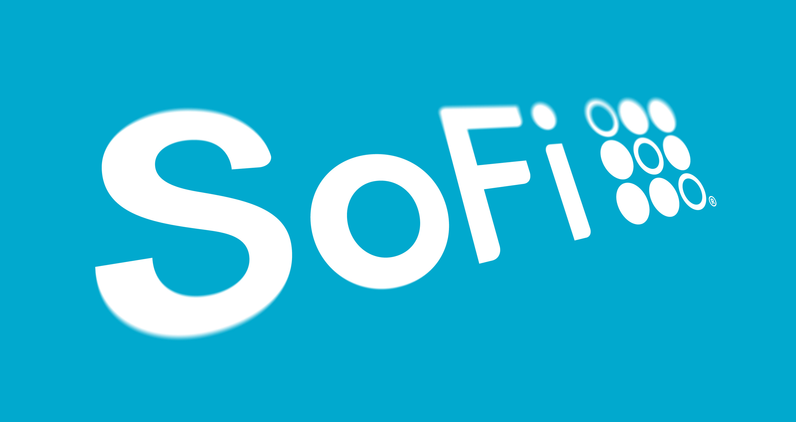

# _SoFI_ _Case_ _study_
---

*  ## Executive Summary :
#
* SoFi, short for Social Finance, is a personal finance company that offers products in the field of banking, loans, investing, and insurance.

* Founded in 2011 and headquartered in San Francisco, SoFi is one of the leading FinTech startups in the United States. The firm has raised $3 billion across 19 rounds of venture capital funding to date.

*  How Does SoFi Make Money ?
#

## What is SoFi & How does it Work ?

SoFi, short for Social Finance, is a FinTech company that offers a variety of personal finance products to American consumers and businesses. Its products can be categorized into 5 distinct categories, namely Borrow, Invest, Spend, Protect, and For Business.

On the Borrow side, SoFi offers a breadth of loans available to consumers. These include (private) student loans, personal loans, as well as home loans. Loans can either be issued or re-financed.

Under SoFi Invest, members can trade stocks and index funds (ETFs), purchase cryptocurrencies, or have money automatically invested via its robo-advisor product, a SoFi-managed Roth or traditional IRA account.

SoFi-branded credit card (offering cashback at selected partners), debit card, as well as credit score monitoring and money tracking via the company’s app.

SoFi Protect allows members to purchase various insurance policies, which are offered in cooperation with other providers. 

All SoFi products can be accessed via the company’s website as well as its mobile phone applications (available on Android and iOS). Over 1 million members frequent its platform every month.

SoFi offers a variety of educational material that is aimed at helping its users improve their financial prowess.
#

## Sofi Company History

SoFi, headquartered in San Francisco, California, was founded in 2011 by Mike Cagney, Dan Macklin, James Finnigan, and Ian Brady, four students who met at the Stanford Graduate School of Business. The founders hoped SoFi could provide more affordable options for thos taking on debt to fund their education. The companys inaugural loan program was a $2 million pilot at Stanford. For this pilot , 40 alumni invested about $2 million in approximately 100 students, for an average of $20,000 per student.

On October 2, 2013, SoFi announced that it had raised $500 million in debt and equity to fund and refinance student loans. This total funding amount came from $90 million in equity, $151 million in debt, and $200 million in bank participations, with the remaining capital from alumni and community investors. The $151 million in debt includes a $60 million line of credit from Morgan Stanley, and a $41 million line of credit from Bancorp.

In May 2016, SoFi became the first startup online lender to receive a triple-A rating from Moody's. In September 2016, SoFi launched SoFi at Work, an employee benefit program to reduce student debt and build financial wellness, and announced it has more than 600 corporate partners. 
As of October 2016, SoFi has funded more than $12 billion in total loan volume and has 175,000 members. In February 2017, it was announced that Social Finance Inc. raised an additional $500 million from an investor group led by Silver Lake, and also including SoftBank, to help support global expansion.

In May 2019, SoFi closed $500 million in a single funding round led by Qatar Investment Authority. In September 2019, SoFi inked a 20-year deal with the Los Angeles Rams and the Los Angeles Chargers of the National Football League (NFL) for the naming rights to SoFi Stadium, in Inglewood, California. The deal, which is worth $30 million annually, is a record for any naming rights for a sports venue.

In April 2020, SoFi acquired Salt Lake City payments firm Galileo for $1.2 billion in stock and cash, and Hong Kong-based investment app 8 Securities.

SoFi announced they will be merging with a SPAC in order to go public at a $9 billion dollar valuation at the end of the first quarter of 2021.After going public, the overall valuation of SoFi increased by over 12%

#

## Business Model & How does SoFi make money.

* Lending

Personal loans, student loans, home loans, and loan refinancing are all part of SoFi's lending services. With over $6 billion dollars in loans issued, SoFi has become one of the largest marketplace lenders. They continue to maintain a policy of no fees for their loans, aside from the interest.  

SoFi started out as a social lending marketplace that matched alumni with students seeking loans.

The loans were backed and issued by the alumni. Consequently, the alumni were the ones that received the money generated by the interest. To make money on the loans, SoFi charged a management fee of 0.75 percent to the alumni. For its newer loan products, such as the mortgage or personal loans, SoFi either works together with other partners  or underwrites loans by itself. SoFi monetizes these loans through a process called whole loan sales. Lenders, in this case SoFi, bundle the loans under management and sell them to an institutional buyer (such as insurance or pension funds).

These buyers pay an upfront premium to SoFi in exchange for the future cash flows that originated through these loans. Because SoFi’s borrowers rarely default, its loan bundles are considered highly secure, which allows them to demand above-average premiums.

* ## Investment Products

SoFi gives members all the freedom they need in choosing the way they would like to invest their money. Members can get started with as little as $1. The investment product is directly linked to the deposit accounts, so members can transfer money between these accounts at will. SoFi earns money from rebates, which it receives from other market makers for choosing them as their execution partners. SoFi partners up with Apex Clearing to conduct the clearing process. SoFi earns a 1.25 percent markup fee for every cryptocurrency transaction conducted through its platform.

* ## Insurance Products

SoFi offers various insurance products through its SoFi Protect division. Under SoFi Protect, members have the option to purchase the following insurance policies:

* Renters Insurance
* Homeowners Insurance
* Auto Insurance
* Life Insurance

Because insurance is both a capital-intensive and highly complex business, SoFi decided to partner up with other companies in the space. Partners include Lemonade (homeowners and renters), Root (auto), and Ladder (life).

As the mitigator, SoFi will earn a referral fee whenever it sells one of these insurance policies through its platform. The amount it earns is dependent on the policy premium and duration (i.e. expected customer lifetime value).

## Deposit Products

SoFi launched debit (called SoFi Money) and credit card products in 2018 and 2020, respectively. The cards are offered in cooperation with the payment processor Mastercard.

With its deposit products, SoFi generates revenue in multiple ways.
SoFi, just like any traditional bank, invests the money of its users into the capital markets, such as bonds, stocks, or index funds. The gains are banked as profit and allow them to pay out interest to its members. SoFi will earn a commission whenever its members pay with their SoFi cards. Example partners include DoorDash and Netflix. The rewards help to incentivize users to use a particular service. In turn, these cashback partners pay a referral fee for every payment sent their way.  

